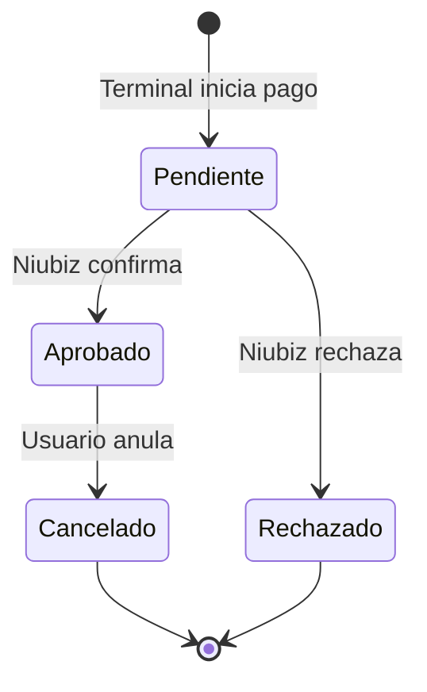

# Dominio: Gestor de Pagos (Pinpad / Niubiz)

**Última actualización:** 2026-04-15
**Estado:** 🟡 Documentación inicial — en construcción

## Descripción

El Gestor de Pagos administra transacciones realizadas con terminales POS (Niubiz/pinpad). Permite visualizar, filtrar y gestionar los cobros realizados en los distintos terminales de la clínica, incluyendo el ciclo de vida completo de una transacción: compra, anulación y sus respectivos vouchers.

---

## Entidades principales

### TransaccionPago

Transacción registrada desde un terminal POS.

| Campo | Tipo | Descripción |
|-------|------|-------------|
| `id` | number | Identificador único |
| `cancelado` | boolean | `true` si la transacción fue anulada |
| `voucher_comercio` | string \| null | Texto del voucher para el comercio (transacción original) |
| `voucher_cliente` | string \| null | Texto del voucher para el cliente (transacción original) |
| `cancelacion_voucher_comercio` | string \| null | Voucher de la anulación (comercio) |
| `cancelacion_voucher_cliente` | string \| null | Voucher de la anulación (cliente) |

Los campos `cancelacion_*` son subqueries desde `transacciones_pagos_cancelaciones`.

### TransaccionPagoCancelacion

Registro de la anulación de una transacción.

| Campo | Descripción |
|-------|-------------|
| `id_transaccion_origen` | FK a `transacciones_pagos.id` |
| `voucher_comercio` | Voucher de la anulación (copia comercio) |
| `voucher_cliente` | Voucher de la anulación (copia cliente) |

---

## Flujo de vida de una transacción



Cuando una transacción pasa a **Cancelado**:
- Se registra un nuevo row en `transacciones_pagos_cancelaciones`
- El campo `cancelado` en `transacciones_pagos` cambia a `true`
- El voucher de la anulación **no sobreescribe** el voucher original; vive en la tabla de cancelaciones

---

## Regla de negocio: selección de voucher

La UI diferencia el voucher a mostrar según el estado de la transacción:

```
cancelado = false → usar transacciones_pagos.voucher_comercio
cancelado = true  → usar transacciones_pagos_cancelaciones.voucher_comercio
```

El subtítulo del diálogo también cambia:
- Normal: "Voucher POS Niubiz"
- Anulado: "Voucher Anulación Niubiz"

Ver trace completo: [[05-TRACES/frontend/voucher-anulacion-gestor-pagos]]

---

## Módulo frontend

**Ruta:** `apps/frontend/src/modules/gestor-pagos/`

| Archivo | Rol |
|---------|-----|
| `components/TransaccionesTable.vue` | Tabla principal con menú contextual |
| `components/VoucherPreviewDialog.vue` | Diálogo de previsualización de voucher |
| `types/transaccion.ts` | Tipos TypeScript del dominio |
| `api/logPeticion.api.ts` | Log de peticiones a bridges (usa `fetch()` directo) |

---

## Servicio backend

**Servicio:** `EMR.Financial-Management.Service`
**Módulo:** `src/modules/pinpad/`

| Archivo | Rol |
|---------|-----|
| `domain/entities/TransaccionPago.ts` | Interfaz `TransaccionPagoAttributes` |
| `infrastructure/repositories/TransaccionPago.sequelize.ts` | Implementación Sequelize con subqueries de cancelación |

---

## Notas de implementación

- Los vouchers de cancelación se obtienen como **subqueries en `attributes.include`** de Sequelize (no como JOIN), para mantener la consulta principal simple y solo enriquecer cuando el dato existe.
- La función `registrarLogPeticion()` usa `fetch()` directo (no el cliente axios con interceptor) para evitar que un fallo en el log dispare un logout del usuario. Ver [[05-TRACES/frontend/gestor-pagos-dev-mode-401-cascade]].

---

## Relaciones

- **Traces:** [[05-TRACES/frontend/voucher-anulacion-gestor-pagos]], [[05-TRACES/frontend/gestor-pagos-dev-mode-401-cascade]]
- **Servicio backend:** `EMR.Financial-Management.Service`
- **Dominio auth:** [[02-DOMINIOS/autenticacion/]] (interceptor axios, initializeDevMode)

---

**Tags:** #domain/facturacion #project/emr-financial #layer/frontend #layer/backend
