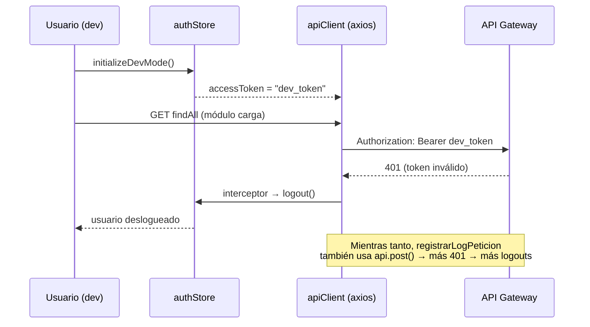
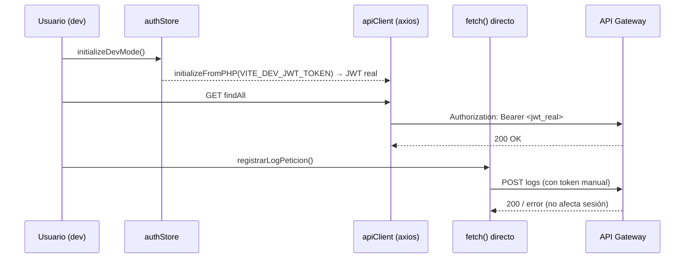

# Trace: Errores 401 en Cascada al Cargar Gestor de Pagos (Dev Mode)

**Última actualización:** 2026-04-15
**Estado:** 🟢 Fix aplicado y documentado

## Origen (dónde comienza)

- **Componente:** `GestorPagosView.vue` (o equivalente de entrada al módulo)
- **Archivo:** `apps/frontend/src/modules/gestor-pagos/`
- **Evento:** Navegación al módulo gestor-pagos en entorno de desarrollo local

## Problema documentado

Al entrar al módulo en desarrollo (npm run dev), se producían múltiples errores 401 en cascada que terminaban deslogueando al usuario involuntariamente:

```
1. findAll?page=1&limit=100  → 401
2. logout                    → 200  (auto-logout disparado por interceptor)
3. create (x4)               → 401
4. lotesActivos              → 401
```

El usuario quedaba fuera de la sesión sin haber hecho nada.

## Causa raíz

Dos problemas independientes que se amplificaban entre sí:

### Problema 1 — Token inválido en dev mode

`initializeDevMode()` en `authStore` seteaba:

```typescript
accessToken.value = 'dev_token'  // string literal, NO es un JWT válido
```

El API Gateway rechaza cualquier token que no sea un JWT bien firmado → 401 en cada llamada.

### Problema 2 — Interceptor demasiado agresivo

El interceptor de axios en `apiClient` llamaba `authStore.logout()` ante **cualquier 401**, incluso en endpoints de background (logs de petición, puentes). Esto amplificaba un 401 aislado en un logout completo.

Adicionalmente, `registrarLogPeticion` usaba `api.post()` (con interceptor), por lo que sus propios 401 disparaban logouts adicionales, creando la cascada.

---

## Flujo por capas

### Problema 1 — authStore dev mode

**Archivo:** `apps/frontend/src/modules/auth/stores/authStore.ts`

**Antes:**
```typescript
function initializeDevMode() {
  accessToken.value = 'dev_token'
  // ...configuración mock sin JWT real
}
```

**Después:**
```typescript
function initializeDevMode() {
  const devJwt = import.meta.env.VITE_DEV_JWT_TOKEN
  if (devJwt) {
    initializeFromPHP(devJwt)  // reutiliza la misma inicialización que producción
  } else {
    accessToken.value = 'dev_token'  // fallback para entornos sin JWT configurado
  }
}
```

**Configuración requerida en `.env.local`:**
```
VITE_DEV_JWT_TOKEN=<jwt_válido_de_staging_o_dev>
```

### Problema 2 — logPeticion usando interceptor de axios

**Archivo:** `apps/frontend/src/modules/gestor-pagos/api/logPeticion.api.ts`

**Antes:**
```typescript
// Usaba api.post() — pasa por interceptor de axios
async function registrarLogPeticion(data: LogPeticion) {
  return api.post('/microservicesFacturacion/logs', data)
}
```

**Después:**
```typescript
// Usa fetch() directo — no pasa por interceptor
async function registrarLogPeticion(data: LogPeticion) {
  const token = authStore.accessToken
  return fetch(`${baseUrl}/microservicesFacturacion/logs`, {
    method: 'POST',
    headers: {
      'Content-Type': 'application/json',
      ...(token ? { Authorization: `Bearer ${token}` } : {})
    },
    body: JSON.stringify(data)
  })
}
```

Un fallo en el log de peticiones ya **no puede desloguear al usuario**.

---

## Flujo del problema (antes del fix)



## Flujo corregido (después del fix)



---

## Errores esperados (no son bugs)

Tras el fix, algunos errores persisten pero son normales:

| Endpoint | Código | Motivo |
|----------|--------|--------|
| `info` (EMR-PEN, EMR-USD, FEVA-PEN) | 500 | Bridges desconectados en entorno de dev |
| `info` (FEBA-USD) | 200 | Bridge conectado — correcto |

Estos no desloguean al usuario porque `registrarLogPeticion` ya usa `fetch()`.

---

## Relaciones

| Aspecto | Relacionado | Notas |
|---------|-------------|-------|
| Dominio | [[02-DOMINIOS/facturacion/gestor-pagos]] | Módulo afectado |
| authStore | `apps/frontend/src/modules/auth/stores/authStore.ts` | Inicialización dev mode |
| apiClient | `apps/frontend/src/shared/services/` | Interceptor de axios |
| logPeticion API | `apps/frontend/src/modules/gestor-pagos/api/logPeticion.api.ts` | Cambiado a fetch |
| Patrón | Aislar side-effects del interceptor usando `fetch()` directo | Ver descubrimientos |

---

## Descubrimientos

- **El interceptor de axios es global**: cualquier 401, incluso de llamadas de background, dispara logout. Para llamadas no críticas (logs, telemetría, pings), usar `fetch()` directo evita este problema.
- **`VITE_DEV_JWT_TOKEN` como patrón**: permite que el entorno de desarrollo use un JWT real (de staging) sin necesidad de modificar código. El fallback a `dev_token` se mantiene para entornos que no tienen el archivo `.env.local` configurado.
- **`initializeFromPHP()` como función reutilizable**: es el punto único de inicialización de sesión desde un JWT externo. Reutilizarla en dev mode garantiza que el estado de auth sea idéntico al de producción.

---

## Tags

#layer/frontend #domain/facturacion #domain/autenticacion #project/emr-frontend #status/documented #pattern/dev-mode
**Última revisión:** 2026-04-15
