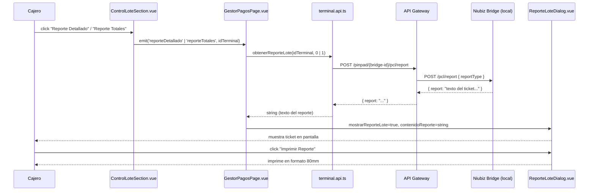

# Trace: Reportes de Lote en ControlLoteSection

## Origen

- **Vista:** `GestorPagosPage.vue` — Panel de Control del Gestor de Pagos
- **Componente emisor:** `ControlLoteSection.vue`
- **Componente receptor del resultado:** `ReporteLoteDialog.vue`
- **Archivo API:** `apps/frontend/src/modules/gestor-pagos/api/terminal.api.ts`
- **Evento disparador:** click en botón "Reporte Detallado" o "Reporte Totales"

## Objetivo

Documentar el flujo completo desde que el cajero hace click en uno de los botones de reporte hasta que el reporte se muestra en pantalla e imprime desde el POS Niubiz.

---

## Flujo por capas

### Capa Frontend — Componente `ControlLoteSection.vue`

Los dos botones viven en la sección de control de lote activo, organizados por terminal en tabs. Ambos están **deshabilitados si el lote no tiene transacciones**.

```typescript
// Emits declarados en ControlLoteSection.vue
const emit = defineEmits<{
  cerrarLote: [idTerminal: string]
  reporteDetallado: [idTerminal: string]
  reporteTotales: [idTerminal: string]
}>()

function onReporteDetallado(terminal: Terminal) {
  emit('reporteDetallado', terminal.id)
}

function onReporteTotales(terminal: Terminal) {
  emit('reporteTotales', terminal.id)
}
```

Condición de habilitación:
```html
:disabled="getTransaccionesParaTerminal(terminal.serialNumber || '') === 0"
```

### Capa Frontend — Vista `GestorPagosPage.vue`

La vista escucha los emits de `ControlLoteSection` y llama directamente a la función de API.

**Pasos (Reporte Detallado):**
1. Emit `reporte-detallado` llega con `idTerminal: string`
2. Se activa `cargandoReporte = true` y se asigna `tituloReporte = 'Reporte Detallado'`
3. Se llama `obtenerReporteLote(idTerminal, 0)`
4. Si exitoso: `contenidoReporte = data.report`, `mostrarReporteLote = true`
5. Si error: `showError(...)` con mensaje del catch
6. Siempre: `cargandoReporte = false`

**Pasos (Reporte Totales):**
Idéntico al anterior pero pasa `reportType: 1` y `tituloReporte = 'Reporte Totales'`.

```typescript
async function onReporteDetallado(idTerminal: string) {
  cargandoReporte.value = true
  tituloReporte.value = 'Reporte Detallado'
  try {
    contenidoReporte.value = await obtenerReporteLote(idTerminal, 0)
    mostrarReporteLote.value = true
  } catch (e) {
    showError(e instanceof Error ? e.message : 'Error al obtener reporte detallado')
  } finally {
    cargandoReporte.value = false
  }
}
```

### Capa API — `terminal.api.ts`

```typescript
export async function obtenerReporteLote(idBridge: string, reportType: 0 | 1): Promise<string> {
  const bridgeUrl = getBridgeUrl(idBridge)

  const response = await fetchConLog(idBridge, '/pcl/report', `${bridgeUrl}/pcl/report`, {
    method: 'POST',
    headers: { 'Content-Type': 'application/json' },
    body: JSON.stringify({ reportType })
  })

  if (!response.ok) throw new Error(`Error al obtener reporte: ${response.status}`)

  const data = await response.json()
  return data.report as string
}
```

`getBridgeUrl(idBridge)` resuelve la URL base según `BRIDGE_CONFIGS`:

| `idBridge` | `bridgeUrl` | Sede | Moneda |
|------------|-------------|------|--------|
| `MR-PEN` | `/pinpad/MR-PEN` | EMR | PEN |
| `MR-USD` | `/pinpad/MR-USD` | EMR | USD |
| `FEBA-PEN` | `/pinpad/FEBA-PEN` | FEVA | PEN |
| `FEBA-USD` | `/pinpad/FEBA-USD` | FEVA | USD |

La función usa `fetchConLog` (wrapper interno de `fetch`) que adicionalmente registra la petición y la respuesta via `registrarLogPeticion`.

### Capa Bridge — Niubiz POS Bridge (servicio local)

El bridge corre localmente en el PC del cajero. El API Gateway proxy-ea el path `/pinpad/{bridge-id}/*` al bridge correspondiente.

**Request:**
```
POST /pinpad/{bridge-id}/pcl/report
Content-Type: application/json

{ "reportType": 0 }
```

**Response:**
```json
{
  "report": "   NIUBIZ   \n DETALLE DE OPERACIONES\n ..."
}
```

| `reportType` | Descripción |
|-------------|-------------|
| `0` | Reporte Detallado — operaciones por transacción |
| `1` | Reporte Totales — totales agrupados por tarjeta/banco |

### Capa Frontend — Componente `ReporteLoteDialog.vue`

Dialog PrimeVue que renderiza el reporte como ticket de impresión.

- Props: `titulo: string`, `reporte: string`
- Usa `v-model:visible` para control de visibilidad
- Renderiza el texto con `<pre class="voucher-text">` para respetar el formato del ticket
- Botón "Imprimir Reporte": crea un `<iframe>` oculto con CSS `@page { size: 80mm auto }` y llama `iframe.contentWindow.print()`

---

## Diagrama del flujo



---

## Relaciones

| Aspecto | Relacionado | Notas |
|---------|-------------|-------|
| **Módulo** | `apps/frontend/src/modules/gestor-pagos/` | Módulo completo |
| **Bridge externo** | Niubiz POS Bridge | Servicio local en PC del cajero |
| **Proxy** | EMR.Api-Gateway.Service | Proxya `/pinpad/{id}/*` al bridge |
| **Patrón de ticket** | `lib/voucher-ticket.css` | CSS compartido con `VoucherPreviewDialog` |
| **Log de peticiones** | `api/logPeticion.api.ts` | Registra toda llamada al bridge |

---

## Descubrimientos

- **Habilitación condicional:** Los botones solo se habilitan si `total_transacciones > 0` en el lote activo. No hay loading state específico para el reporte (usa `cargandoReporte` en la vista pero no se propaga al componente hijo).
- **Sin base de datos:** El reporte viene directo del bridge Niubiz; el backend EMR no almacena el texto del reporte.
- **Formato ticket:** El bridge retorna texto plano con saltos de línea (`\n`) que `<pre>` renderiza correctamente. El CSS de impresión fuerza `80mm` de ancho.
- **Reutilización de CSS:** `ReporteLoteDialog.vue` importa el mismo `voucher-ticket.css` que `VoucherPreviewDialog.vue`, garantizando consistencia visual entre vouchers de cobro y reportes de lote.

---

## Notas

- `horaInicioMock` y `proximoCierreMock` en `ControlLoteSection` son valores simulados (`'08:00 AM'` y `'23:59 PM'`). Pendiente conectar con datos reales del lote.
- El `cargandoReporte` en `GestorPagosPage` no se pasa como prop a `ControlLoteSection`, por lo que los botones no muestran estado de carga durante la petición al bridge.

---

**Tags:** #layer/frontend #domain/gestor-pagos #bridge/niubiz
**Ultima revision:** 2026-04-15
