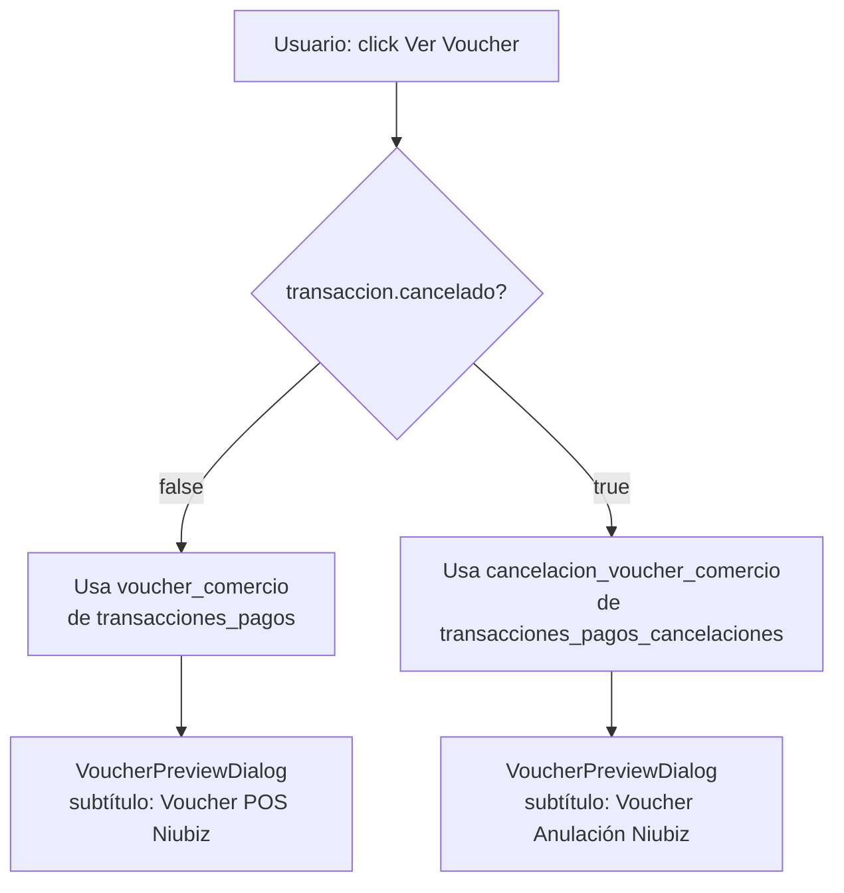

# Trace: Voucher de Anulación en Gestor de Pagos

**Última actualización:** 2026-04-15
**Estado:** 🟢 Fix aplicado y documentado

## Origen (dónde comienza)

- **Componente:** `TransaccionesTable.vue` → botón "Ver Voucher" en menú contextual
- **Archivo:** `apps/frontend/src/modules/gestor-pagos/components/TransaccionesTable.vue`
- **Evento:** Click en ítem "Ver Voucher" del menú de acciones de una transacción con estado "Cancelado"

## Problema documentado

Al abrir el voucher de una transacción cancelada, el diálogo mostraba el voucher de la **transacción original** (compra), no el de la **anulación**. El usuario veía datos incorrectos.

## Causa raíz

Los vouchers de anulación residen en una tabla separada (`transacciones_pagos_cancelaciones`), en los campos `voucher_comercio` y `voucher_cliente`. El query del repositorio no los incluía, y la UI tampoco los distinguía por estado.

---

## Flujo por capas

### Capa Frontend (UI)

**Componente:** `TransaccionesTable.vue`

La función `abrirVoucher()` recibía siempre `transaccion.voucher_comercio` sin distinguir si la transacción estaba cancelada. El diálogo `VoucherPreviewDialog.vue` tampoco diferenciaba el origen del contenido.

**Corrección aplicada:**

```typescript
// TransaccionesTable.vue — abrirVoucher() antes del fix
function abrirVoucher(transaccion: TransaccionPago) {
  voucherSeleccionado.value = transaccion.voucher_comercio
  // Sin distinción de estado
}

// TransaccionesTable.vue — después del fix
function abrirVoucher(transaccion: TransaccionPago) {
  const esCancelado = transaccion.cancelado === true
  voucherSeleccionado.value = esCancelado
    ? transaccion.cancelacion_voucher_comercio
    : transaccion.voucher_comercio
}
```

**Tipo actualizado:**

```typescript
// apps/frontend/src/modules/gestor-pagos/types/transaccion.ts
interface TransaccionPago {
  // ... campos existentes
  cancelacion_voucher_comercio: string | null  // agregado
  cancelacion_voucher_cliente: string | null   // agregado
}
```

**Componente VoucherPreviewDialog.vue — lógica de detección:**

```typescript
// Computed que detecta anulación
const esAnulacion = computed(() => props.transaccion?.cancelado === true)

// Computed que selecciona el contenido correcto
const contenidoVoucher = computed(() =>
  esAnulacion.value
    ? props.transaccion?.cancelacion_voucher_comercio
    : props.transaccion?.voucher_comercio
)
```

El subtítulo del diálogo también cambia dinámicamente:
- Transacción normal: "Voucher POS Niubiz"
- Transacción cancelada: "Voucher Anulación Niubiz"

### Capa Backend (API)

**Servicio:** `EMR.Financial-Management.Service`
**Archivo:** `services/EMR.Financial-Management.Service/src/modules/pinpad/infrastructure/repositories/TransaccionPago.sequelize.ts`
**Método afectado:** `findByTerminalesLote()`

Se agregaron dos subqueries SQL en `attributes.include` para traer los vouchers de anulación junto con cada transacción:

```typescript
// En attributes.include de findByTerminalesLote
{
  attribute: [
    literal(`(
      SELECT voucher_comercio
      FROM transacciones_pagos_cancelaciones
      WHERE id_transaccion_origen = "TransaccionPago"."id"
      LIMIT 1
    )`),
    'cancelacion_voucher_comercio'
  ]
},
{
  attribute: [
    literal(`(
      SELECT voucher_cliente
      FROM transacciones_pagos_cancelaciones
      WHERE id_transaccion_origen = "TransaccionPago"."id"
      LIMIT 1
    )`),
    'cancelacion_voucher_cliente'
  ]
}
```

**Entidad actualizada:**

```typescript
// TransaccionPago.ts — interfaz TransaccionPagoAttributes
cancelacion_voucher_comercio?: string | null
cancelacion_voucher_cliente?: string | null
```

### Capa Database (BD)

**Base de datos:** PostgreSQL

| Tabla | Campos relevantes | Rol |
|-------|-------------------|-----|
| `transacciones_pagos` | `id`, `voucher_comercio`, `voucher_cliente`, `cancelado` | Transacción origen |
| `transacciones_pagos_cancelaciones` | `id_transaccion_origen`, `voucher_comercio`, `voucher_cliente` | Voucher de la anulación |

**Relación:** `transacciones_pagos_cancelaciones.id_transaccion_origen = transacciones_pagos.id`

---

## Flujo corregido



---

## Relaciones

| Aspecto | Relacionado | Notas |
|---------|-------------|-------|
| Dominio | [[02-DOMINIOS/facturacion/gestor-pagos]] | Flujo de pagos y anulaciones |
| Servicio frontend | `apps/frontend/src/modules/gestor-pagos/` | Módulo afectado |
| Servicio backend | `EMR.Financial-Management.Service` | Repositorio con subqueries |
| Patrón usado | Subquery en `attributes.include` de Sequelize | Forma de enriquecer resultados sin JOIN |

---

## Descubrimientos

- **Los vouchers de anulación son entidades separadas**, no campos adicionales en la transacción original. Esto es correcto porque una anulación puede no existir, y mantenerlos en tabla propia evita columnas nulas en el caso base.
- **El campo `cancelado: boolean`** en `TransaccionPago` es el discriminador de estado. La UI debe usarlo para seleccionar el origen del voucher.
- **El menú contextual `menuItems`** también usa `cancelado` para evaluar el `disabled` del ítem "Ver Voucher" correctamente en ambos casos.

---

## Tags

#layer/frontend #layer/backend #layer/database #domain/facturacion #project/emr-financial #status/documented
**Última revisión:** 2026-04-15
